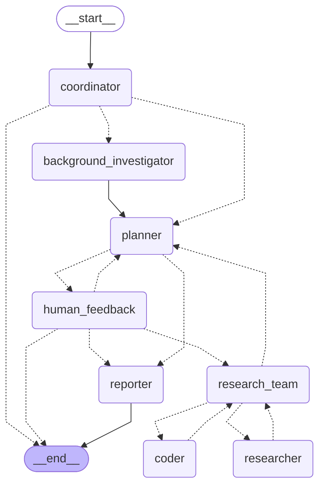
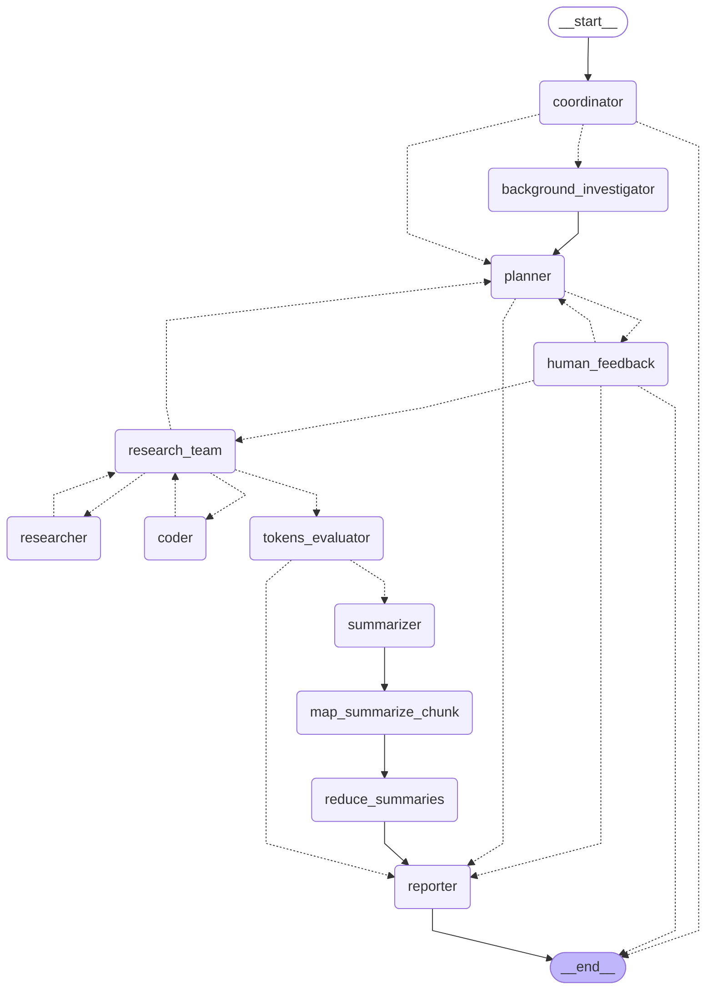

# 🦌 DeerFlowX

> **深度探索与高效研究流程** - 基于 [bytedance/deer-flow](https://github.com/bytedance/deer-flow) 的增强版本

[](https://www.python.org/downloads/)
[](LICENSE)
[](https://github.com/langchain-ai/langgraph)
[](https://fastapi.tiangolo.com/)
[](https://nextjs.org/)

**DeerFlowX** 是一个基于多智能体工作流的深度研究助手，能够帮助您进行网络搜索、信息浏览和复杂任务处理。本项目是对优秀的上游项目 [bytedance/deer-flow](https://github.com/bytedance/deer-flow) 的增强版本，在保持原有核心功能的基础上，增加了更多实用特性和改进。

## 🙏 致谢

首先，我们要向 [bytedance/deer-flow](https://github.com/bytedance/deer-flow) 项目及其贡献者表达最诚挚的感谢！

DeerFlowX 的存在完全基于上游项目的卓越工作。原项目提供了：
- 🏗️ **坚实的架构基础** - 基于 LangGraph 的多智能体工作流框架
- 🎯 **清晰的设计理念** - "Deep Exploration and Efficient Research Flow"
- 🔧 **完整的技术栈** - 从后端 FastAPI 到前端 Next.js 的全栈解决方案
- 📚 **丰富的功能模块** - 搜索、抓取、代码执行等核心工具
- 🌟 **开源精神** - MIT 许可证下的开放贡献

没有上游项目的杰出工作，就没有 DeerFlowX 的今天。我们深深感谢原作者和贡献者们的无私奉献！

在上游项目的基础上, DeerFlowX[已完成的计划](./docs/x/plan/done/), [准备中的计划](./docs/x/plan/)

## DeepResearch Graph一览

### 原来的实现



### 当前实现
> [!note]
> 你可以使用该命令生成最新图表
> ```bash
> uv run python src/deerflowx/graphs/research/graph/builder.py
> ```




## 🚀 快速开始

### 环境要求

- Python 3.12+
- Node.js 18+
- pnpm (推荐) 或 npm

### 安装步骤

1. **克隆仓库**
   ```bash
   git clone https://github.com/SecondaryLair/deer-flow.git
   cd deer-flow
   ```

2. **后端设置**
   ```bash
   # 使用 uv 安装依赖（推荐）
   uv sync

   # 配置环境变量
   cp .env.example .env
   # 编辑 .env 文件，添加您的 API 密钥
   ```

3. **前端设置**
   ```bash
   cd web
   pnpm install
   ```

4. **启动服务**
   ```bash
   # 后端
   uv run python main.py --interactive

   # 前端（新终端）
   cd web
   pnpm dev
   ```

5. **访问应用**
   - 前端界面: http://localhost:3000
   - API 文档: http://localhost:8000/docs

## 主要功能

### 🔍 智能研究助手
- **多智能体协作**：规划师、研究员、编码员等角色协同工作
- **深度调研**：支持两阶段调研（调查 → 报告）
- **实时反馈**：SSE 流式推送，实时展示研究进展

### 🛠️ 强大的工具集
- **网络搜索**：DuckDuckGo、Tavily、arXiv 等多种搜索引擎
- **网页抓取**：智能内容提取和可读性优化
- **代码执行**：安全的 Python REPL 环境
- **数据处理**：pandas、numpy 支持的数据分析

### 🎨 现代化前端
- **响应式设计**：适配各种设备和屏幕尺寸
- **实时交互**：流式消息展示和状态更新
- **主题支持**：明暗主题切换
- **组件丰富**：基于 shadcn/ui 的现代组件库

## 🏗️ 技术架构

### 后端技术栈
- **框架**: FastAPI + uvicorn
- **AI 编排**: LangGraph + LangChain
- **LLM 支持**: OpenAI、DeepSeek、Volcengine 等
- **数据处理**: pandas、numpy
- **可观测性**: Langfuse 集成

### 前端技术栈
- **框架**: Next.js 14 App Router
- **状态管理**: Zustand
- **UI 组件**: shadcn/ui + Tailwind CSS
- **动画**: Framer Motion
- **类型安全**: TypeScript

### 工作流引擎
- **核心**: LangGraph 状态图
- **节点类型**: 协调器、规划师、研究员、编码员、报告员
- **状态管理**: 持久化状态和内存管理
- **并发控制**: 智能任务调度和资源管理

## 📖 使用指南

### 基本使用

1. **启动交互式会话**
   ```bash
   uv run python main.py --interactive
   ```

2. **命令行直接查询**
   ```bash
   uv run python main.py "请帮我研究人工智能的最新发展"
   ```

3. **Web 界面使用**
   - 访问 http://localhost:3000
   - 输入您的研究问题
   - 选择是否启用深度思考模式
   - 查看实时研究进展

### 高级功能

- **深度思考模式**：启用后可查看 AI 的推理过程
- **背景调研**：自动进行背景信息收集
- **计划迭代**：支持多轮计划优化
- **自定义配置**：灵活的 LLM 和工具配置

## 🔧 配置说明

主要配置通过环境变量管理，详细配置请参考 `.env.example` 文件：

## 🧪 开发与测试

### 运行测试
```bash
# 运行所有测试
uv run pytest

```

## 📄 许可证

本项目采用 MIT 许可证，与上游项目保持一致。详情请参阅 [LICENSE](LICENSE) 文件。
