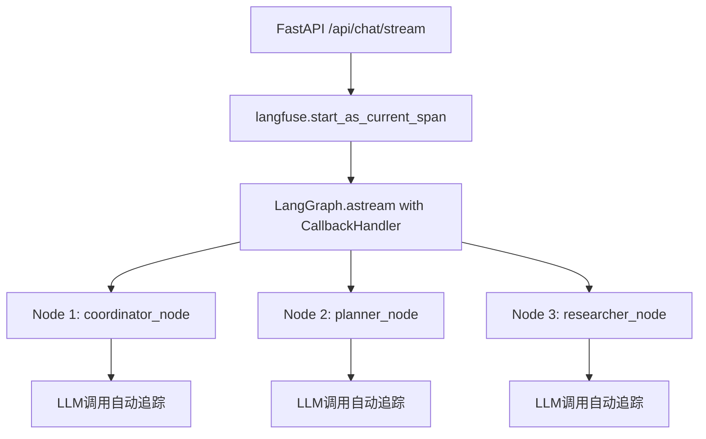

# Langfuse集成DeerFlowX：基于官方最佳实践的重构方案

## 一、目标与背景

### 1.1 现状分析
- DeerFlowX 当前使用 LangGraph 构建复杂的多智能体研究工作流
- 现有Langfuse集成方式过于复杂，使用了自定义装饰器和包装器
- 需要基于Langfuse官方教程重构，采用标准化最佳实践

### 1.2 重构目标
- **简化集成**：移除复杂的自定义装饰器，采用官方推荐的CallbackHandler方式
- **标准化**：遵循Langfuse官方LangGraph集成最佳实践
- **统一追踪**：实现端到端的trace追踪，从FastAPI入口到LangGraph节点
- **最小侵入**：对现有业务逻辑代码的修改最少

### 1.3 参考文档
- [LangGraph Integration](https://langfuse.com/docs/integrations/langchain/example-python-langgraph)
- [LangChain Tracing](https://langfuse.com/docs/integrations/langchain/tracing)
- [Python Example](https://langfuse.com/docs/integrations/langchain/example-python)

## 二、技术方案

### 2.1 核心原则
根据官方文档，Langfuse与LangGraph的最佳集成方式是：
1. **在FastAPI入口层**：创建顶级trace上下文, 针对我们这个项目的中的langgraph图 ./src/deerflowx/workflow.py 中的 graph 对象做一个trace, trace_id 如果需要使用uuid生成, 不要生成多个trace, 我希望一个业务事务 是整个核心逻辑的图
2. **在LangGraph执行层**：通过config传递CallbackHandler
3. **在节点内部**：LangChain调用自动继承trace上下文

### 2.2 集成架构



### 2.3 实现方案

#### 2.3.1 FastAPI入口层改造
```python
# server/app.py
from langfuse import get_client
from langfuse.langchain import CallbackHandler

@app.post("/api/chat/stream")
async def chat_stream(request: ChatRequest) -> StreamingResponse:
    langfuse = get_client()

    # 创建顶级trace
    with langfuse.start_as_current_span(
        name="deepresearch-workflow",
        input={
            "messages": request.messages,
            "enable_deep_thinking": request.enable_deep_thinking,
            "report_style": request.report_style.value,
        }
    ) as span:
        # 更新trace属性
        span.update_trace(
            session_id=request.thread_id,
            user_id="deerflow-user",  # 可从request中获取
            tags=["research", "langgraph"]
        )

        # 创建CallbackHandler
        langfuse_handler = CallbackHandler()

        # 执行工作流
        return StreamingResponse(
            _execute_workflow_with_langfuse(
                request, langfuse_handler, span
            ),
            media_type="text/event-stream",
        )
```

#### 2.3.2 LangGraph执行层改造
```python
async def _execute_workflow_with_langfuse(
    request: ChatRequest,
    langfuse_handler: CallbackHandler,
    span: Any
) -> AsyncGenerator[str, None]:
    # 构建输入
    input_ = {
        "messages": request.messages,
        "research_topic": request.messages[-1].content if request.messages else "",
        # ... 其他状态字段
    }

    # 配置
    config: RunnableConfig = {
        "configurable": {
            "thread_id": request.thread_id,
            "resources": request.resources,
            "max_plan_iterations": request.max_plan_iterations,
            # ... 其他配置
        },
        "callbacks": [langfuse_handler],  # 关键：传递CallbackHandler
    }

    # 执行LangGraph
    async for agent, _, event_data in graph.astream(
        input_,
        config=config,
        stream_mode=["messages", "updates"],
        subgraphs=True,
    ):
        # 处理流式输出
        yield _process_stream_event(agent, event_data, request.thread_id)

    # 更新最终输出
    span.update_trace(output={"status": "completed"})
```

#### 2.3.3 节点层简化
移除复杂的装饰器，节点函数保持简洁：

```python
# graph/nodes.py
def coordinator_node(
    state: State,
    config: RunnableConfig,
) -> Command[Literal["planner", "background_investigator", "__end__"]]:
    """协调器节点 - 无需特殊装饰器"""
    logger.info("Coordinator talking.")

    configurable = Configuration.from_runnable_config(config)
    messages = apply_prompt_template("coordinator", state)

    # 直接使用LLM，CallbackHandler会自动追踪
    llm = get_llm_by_type(AGENT_LLM_MAP["coordinator"]).bind_tools([handoff_to_planner])
    response = llm.invoke(messages, config=config)  # config包含callbacks

    # 处理响应逻辑...
    return Command(goto="planner")

def planner_node(state: State, config: RunnableConfig) -> dict[str, Any]:
    """规划器节点 - 无需特殊装饰器"""
    logger.info("Planner creating research plan.")

    configurable = Configuration.from_runnable_config(config)
    messages = apply_prompt_template("planner", state)

    # 直接使用LLM，CallbackHandler会自动追踪
    llm = get_llm_by_type(AGENT_LLM_MAP["planner"])
    response = llm.invoke(messages, config=config)  # config包含callbacks

    # 处理响应逻辑...
    return {"current_plan": response.content}
```
