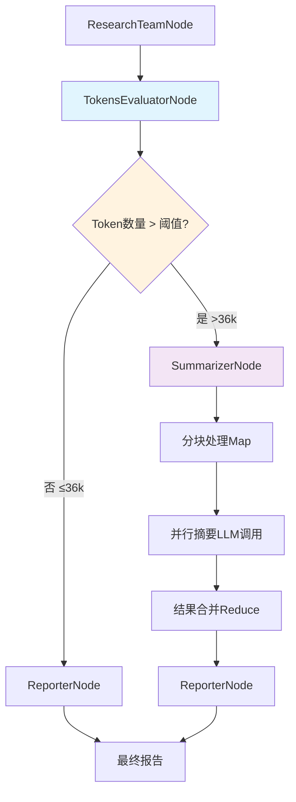
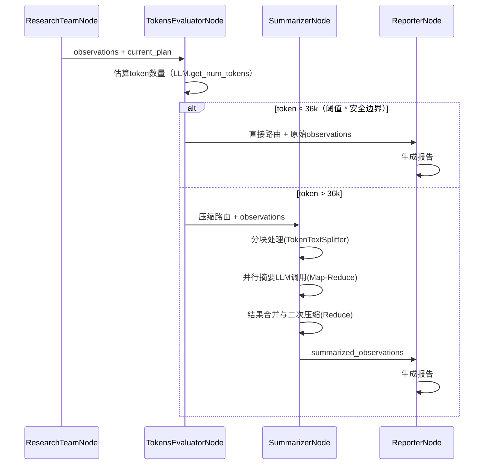

# Report阶段Token超限问题的智能解决方案

## 需求背景

当前的研究流程中，`ReporterNode` 会将大量的 `observations`（网页抓取内容）直接送入LLM生成报告。面对复杂问题时，累计文本长度常超过模型上下文窗口，导致频繁的 `max-token-limit` 错误。

**核心挑战：**
- 信息量巨大：原始检索内容远超LLM上下文窗口
- 避免信息失真：简单压缩容易丢失关键细节或产生幻觉
- 保持任务相关性：需要有针对性的信息筛选

## 解决方案：智能压缩决策系统

### 系统架构



### 核心组件

#### TokensEvaluatorNode（智能决策节点）
- **功能**：快速评估observations的token数量，决定处理路径
- **算法**：使用LangChain原生的`get_num_tokens`方法，回退时使用LangChain的`count_tokens_approximately`
- **阈值**：默认36k tokens（45k * 0.8安全边界，适配DeepSeek等模型的65536上下文窗口）

```python
class TokensEvaluatorNode(NodeBase):
    async def action(cls, state: State, config: RunnableConfig) -> dict[str, Any]:
        # 1. 使用LangChain LLM的get_num_tokens精确计算
        # 2. 与配置阈值比较（考虑安全边界）
        # 3. 返回路由决策：direct_to_reporter | compress_first
```

#### SummarizerNode（分层摘要节点）
- **策略**：Map-Reduce分层处理
- **Map阶段**：使用`TokenTextSplitter`分块处理，query-aware提取相关信息
- **Reduce阶段**：合并压缩，生成summarized_observations

**核心Prompt示例：**
```
研究任务：'{current_plan.thought}'
请基于以上任务，从以下文本中提取所有关键事实、数据、观点和引用。
忽略与任务无关的营销辞令、导航链接和通用描述。
请以要点的形式输出。
文本：'{chunk_text}'
```

### 状态管理

#### 新增状态字段
```python
class State(TypedDict):
    # ... 原有字段 ...

    # 智能压缩状态 (NotRequired标记，兼容现有流程)
    compression_decision: NotRequired[str]      # 决策结果
    estimated_tokens: NotRequired[int]         # 估算token数
    decision_reason: NotRequired[str]          # 决策原因
    summarized_observations: NotRequired[str]  # 摘要后内容
```

#### ReporterNode智能适配
```python
async def reporter_node(state: State, config: RunnableConfig):
    # 智能选择数据源：优先使用摘要后的内容，如果没有则使用原始observations
    summarized_observations = state.get("summarized_observations", "")
    observations = state.get("observations", [])

    if summarized_observations:
        observation_content = summarized_observations
        data_source_note = "注意: 本报告基于智能摘要的研究内容生成。"
    else:
        observation_content = "\n\n".join(observations) if observations else ""
        data_source_note = "注意: 本报告基于完整的研究内容生成。"
    # 生成报告...
```

### 处理流程



### 配置参数

```python
# 智能压缩配置（适配DeepSeek等模型）
max_observations_tokens: int = 45000          # token阈值45k
compression_safety_margin: float = 0.8         # 安全边界80% → 36k有效阈值
summarizer_chunk_size: int = 8000             # 分块大小
summarizer_chunk_overlap: int = 400           # 块重叠
summarizer_enable_second_pass: bool = True    # 二次摘要
```

### 图路由架构

实际的图路由流程为：
1. `ResearchTeamNode` → `TokensEvaluatorNode`（研究完成后进行token估算）
2. `TokensEvaluatorNode` → `ReporterNode`（直接路由）或 `SummarizerNode`（压缩路由）
3. `SummarizerNode` → `MapSummarizeChunkNode`（使用Send API并行处理）
4. `MapSummarizeChunkNode` → `ReduceSummariesNode`（自动收集结果）
5. `ReduceSummariesNode` → `ReporterNode`（摘要完成）

### 验证结果

- **小任务**：跳过摘要处理，减少30-50%处理时间
- **大任务**：避免token超限，确保系统稳定
- **质量保障**：query-aware压缩保持信息相关性
- **兼容性**：NotRequired字段标记确保向后兼容

### 技术细节

#### 文本分块优化
使用LangChain的`TokenTextSplitter`替代手动的tiktoken处理：
```python
def split_text_into_chunks(text: str, chunk_size: int, overlap: int) -> list[str]:
    splitter = TokenTextSplitter(chunk_size=chunk_size, chunk_overlap=overlap)
    chunks = splitter.split_text(text)
    return chunks if chunks else [text]  # 回退处理
```

#### 二次压缩策略
如果合并后的摘要仍超过阈值的一半，自动触发二次压缩：
```python
if combined_tokens > configurable.max_observations_tokens // 2:
    # 执行二次整合压缩
```

### 扩展性

未来可将SummarizerNode重构为通用的SummarizerService：

```python
def create_summarizer_node(
    input_key: str,      # 输入字段名
    output_key: str,     # 输出字段名
    context_key: str     # 上下文字段名
) -> Callable:
    # 返回配置化的摘要节点
```

实现完全解耦的服务化架构，可在任何需要摘要功能的图中复用。