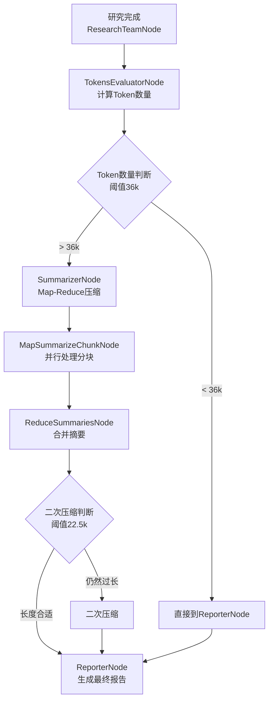
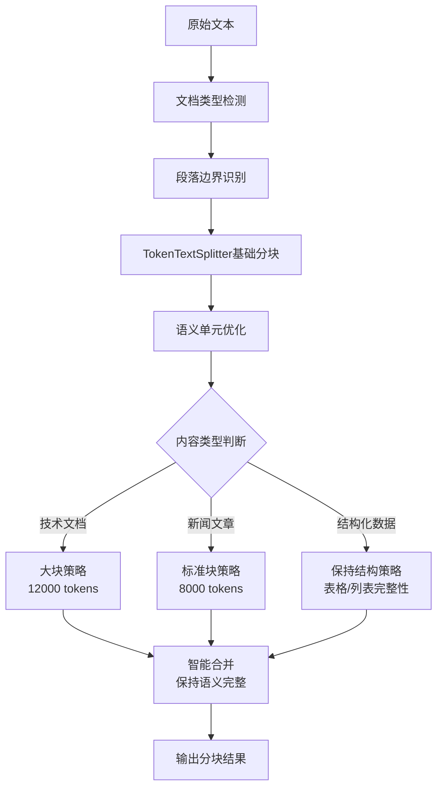
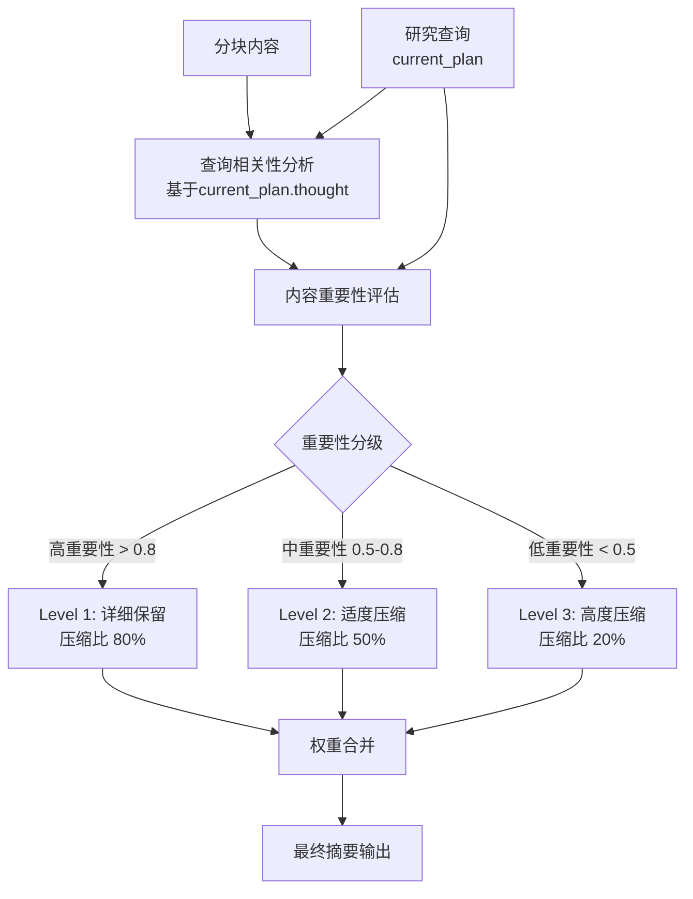
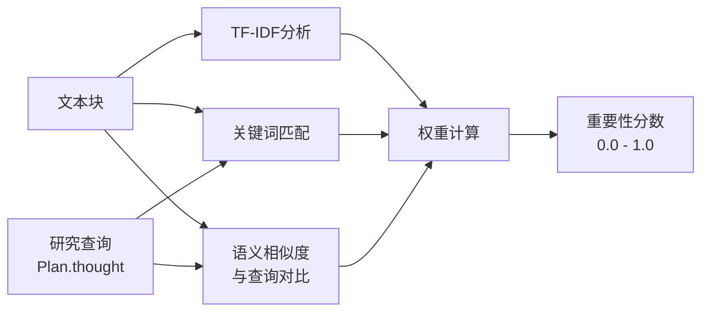
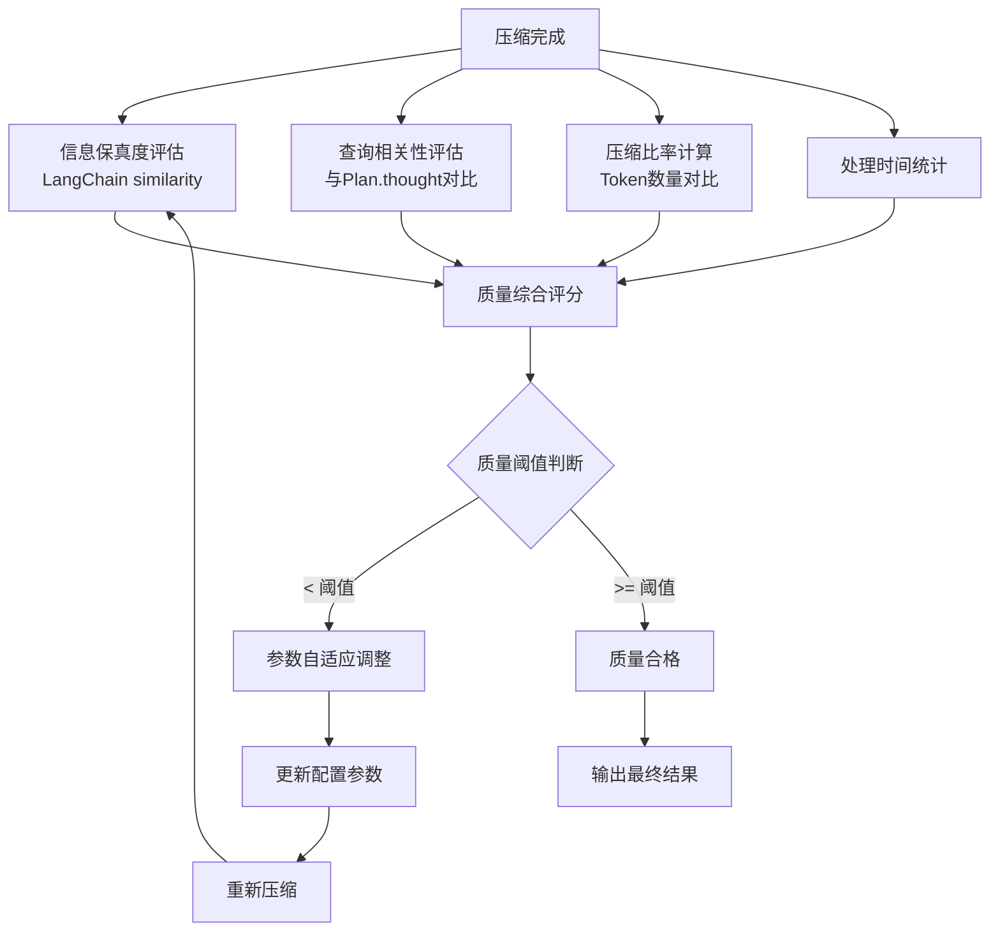
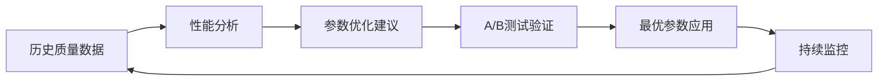
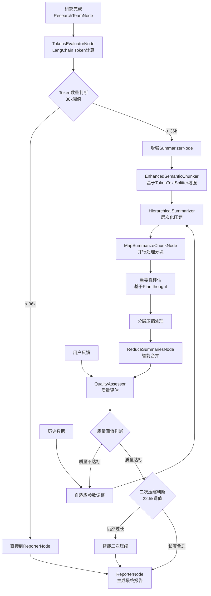
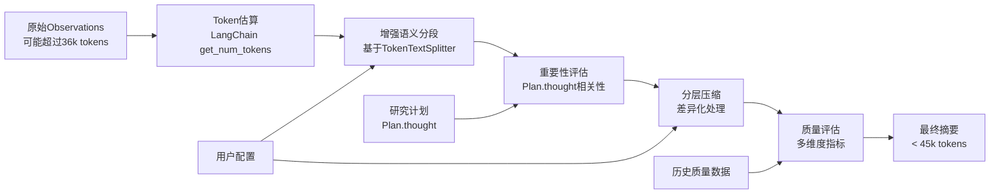

# 优化总结压缩节点处理方式

## 背景

当前的智能压缩系统已经成功解决了 max-token-limit 错误问题，使用 Map-Reduce 策略进行分段处理。但在使用过程中发现一些可以进一步优化的空间，特别是在信息保真度、处理效率和用户体验方面。

## 当前实现回顾

### 已完成的功能
- **TokensEvaluatorNode**: 使用LangChain原生的`get_num_tokens`方法精确计算token数量，智能路由
- **SummarizerNode**: Map-Reduce 分段压缩，支持 Send API 并行处理
- **智能路由**: 根据 token 数量决定是否需要压缩
- **二次压缩**: 当摘要仍然过长时进行再次压缩

### 当前系统架构


### 当前配置参数
```yaml
# 实际配置参数（适配DeepSeek等模型的65536上下文窗口）
max_observations_tokens: 45000          # token 阈值45k
compression_safety_margin: 0.8          # 安全边际80% → 36k有效阈值
summarizer_chunk_size: 8000             # 分块大小
summarizer_chunk_overlap: 400           # 重叠区域
summarizer_enable_second_pass: true     # 二次压缩
```

## 识别的问题

### 1. 信息丢失风险
**问题**: 当前基于TokenTextSplitter的分块虽然比字符分块更智能，但仍可能破坏语义连续性
```python
# 可能出现的问题场景
chunk_1 = "关于AI在教育中的应用，研究显示"
chunk_2 = "效果显著，特别是在个性化学习方面..."
```

**影响**: 重要的上下文关联可能在分块过程中丢失

### 2. 分块策略还需进一步优化
**问题**: 固定的 chunk_size=8000 不能适应不同类型的内容
- 技术文档可能需要更大的上下文窗口
- 新闻类内容可能可以用更小的块处理
- 结构化数据（表格、列表）需要特殊处理

### 3. 二次压缩逻辑需要增强
**问题**: 当前仅基于 token 数量判断是否需要二次压缩
```python
if combined_tokens > configurable.max_observations_tokens // 2:
    # 简单的二次压缩，阈值为22.5k
```

**缺陷**:
- 没有考虑内容重要性
- 没有考虑查询相关性
- 压缩质量无法保证

### 4. 缺乏质量评估机制
**问题**: 无法评估压缩质量，可能出现关键信息丢失而不自知

## 优化方案

### 方案一：智能分段策略 (优先级: 高)

#### 目标
在现有TokenTextSplitter基础上，实现基于语义的智能分段增强

#### 实现思路
1. **段落边界分段**: 优先在段落、句子边界进行分割
2. **语义完整性检查**: 确保每个分块包含相对完整的语义单元
3. **动态块大小**: 根据内容类型调整分块大小

#### 智能分段流程图


#### 技术实现
```python
class EnhancedSemanticChunker:
    def __init__(self, base_chunk_size: int = 8000, overlap: int = 400):
        self.base_splitter = TokenTextSplitter(
            chunk_size=base_chunk_size,
            chunk_overlap=overlap
        )

    def chunk_by_enhanced_semantics(self, text: str, max_tokens: int) -> List[str]:
        # 1. 使用TokenTextSplitter基础分块
        base_chunks = self.base_splitter.split_text(text)

        # 2. 语义完整性优化
        optimized_chunks = self._optimize_semantic_boundaries(base_chunks)

        # 3. 根据内容类型调整
        final_chunks = self._adjust_by_content_type(optimized_chunks)

        return final_chunks
```

#### 配置参数
```yaml
enhanced_chunking:
  strategy: "enhanced_semantic"  # "simple" | "enhanced_semantic" | "hybrid"
  base_chunk_size: 8000          # 基础分块大小
  chunk_overlap: 400             # 重叠区域
  semantic_min_chunk_size: 4000  # 最小语义块大小
  semantic_max_chunk_size: 12000 # 最大语义块大小
  preserve_structure: true       # 保持表格、列表结构
```

### 方案二：层次化压缩策略 (优先级: 中)

#### 目标
实现多层次的压缩策略，根据内容重要性和查询相关性进行分层处理

#### 实现思路
1. **重要性评估**: 为每个文本块评估重要性分数
2. **分层压缩**:
   - Level 1: 保留高重要性内容的详细信息
   - Level 2: 中等重要性内容进行适度压缩
   - Level 3: 低重要性内容高度压缩或丢弃
3. **查询导向**: 根据研究查询调整重要性权重

#### 层次化压缩流程图


#### 重要性评估算法


#### 技术实现
```python
class HierarchicalSummarizer:
    def assess_importance(self, chunk: str, plan: Plan) -> float:
        # 计算内容与研究计划的相关性分数
        query = plan.thought if isinstance(plan, Plan) else str(plan)
        return self._calculate_relevance_score(chunk, query)

    def layered_compression(self, chunks: List[str], plan: Plan) -> str:
        # 基于重要性的分层压缩逻辑
        pass
```

#### 配置参数
```yaml
hierarchical_compression:
  enable: true
  importance_threshold_high: 0.8
  importance_threshold_medium: 0.5
  compression_ratio_high: 0.8    # 高重要性内容保留80%
  compression_ratio_medium: 0.5  # 中等重要性内容保留50%
  compression_ratio_low: 0.2     # 低重要性内容保留20%
```

### 方案三：质量评估与自适应优化 (优先级: 中)

#### 目标
添加压缩质量评估机制，支持自适应优化压缩参数

#### 实现思路
1. **质量指标**:
   - 信息保真度 (Information Fidelity)
   - 压缩比率 (Compression Ratio)
   - 处理时间 (Processing Time)
2. **自适应调整**: 根据质量反馈自动调整压缩参数
3. **用户反馈**: 支持用户对压缩质量进行评价

#### 质量评估流程图


#### 自适应优化策略


#### 技术实现
```python
class CompressionQualityAssessor:
    def evaluate_quality(self, original: str, compressed: str, plan: Plan) -> Dict[str, float]:
        query = plan.thought if isinstance(plan, Plan) else str(plan)
        return {
            "fidelity_score": self._calculate_fidelity(original, compressed),
            "relevance_score": self._calculate_relevance(compressed, query),
            "compression_ratio": self._get_token_ratio(compressed, original)
        }

    def _get_token_ratio(self, compressed: str, original: str) -> float:
        # 使用LangChain的token计算方法
        llm = get_llm_by_type(AGENT_LLM_MAP["researcher"])
        try:
            compressed_tokens = llm.get_num_tokens(compressed)
            original_tokens = llm.get_num_tokens(original)
            return compressed_tokens / original_tokens
        except Exception:
            # 回退到近似计算
            return len(compressed) / len(original)
```

### 方案四：上下文窗口优化利用 (优先级: 低)

#### 目标
更好地利用现代 LLM 的上下文窗口，针对不同模型动态调整策略

#### 实现思路
1. **动态阈值**: 根据模型能力动态调整处理阈值
2. **模型感知**: 不同模型使用不同的优化策略
3. **批处理优化**: 合并小块以充分利用上下文窗口

#### 模型适配策略
```python
MODEL_CONFIG = {
    "deepseek": {
        "context_window": 65536,
        "safe_threshold": 45000,
        "chunk_size": 8000,
    },
    "gpt-4": {
        "context_window": 200000,
        "safe_threshold": 150000,
        "chunk_size": 15000,
    },
    # 其他模型配置...
}
```

## 实施方案

### 优化阶段规划

#### Phase 1: 增强语义分段
1. 在现有`TokenTextSplitter`基础上实现`EnhancedSemanticChunker`
2. 集成到现有的 `SummarizerNode`
3. 添加相关配置选项
4. 编写单元测试

#### Phase 2: 层次化压缩
1. 实现重要性评估算法
2. 开发分层压缩逻辑
3. 集成Plan导向的权重调整
4. 性能测试与优化

#### Phase 3: 质量评估
1. 开发质量评估框架
2. 实现自适应参数调整
3. 添加用户反馈机制
4. 集成到主流程

#### Phase 4: 模型适配优化
1. 不同模型的上下文窗口利用优化
2. 批处理性能提升
3. 整体系统调优

## 成功指标

### 质量指标
- **信息保真度**: 压缩后内容保留原始信息的比例 > 85%
- **查询相关性**: 压缩内容与查询的相关性分数 > 0.8
- **用户满意度**: 用户对压缩质量的评分 > 4.0/5.0

### 性能指标
- **处理速度**: 保持或提升当前的处理速度
- **Token 利用率**: 更好地利用 LLM 的上下文窗口
- **错误率**: 减少因压缩导致的信息丢失错误

### 配置灵活性
- **可配置性**: 用户可以根据需求调整压缩策略
- **兼容性**: 向后兼容现有的TokenTextSplitter模式
- **扩展性**: 易于添加新的压缩算法和策略

## 风险评估

### 技术风险
- **复杂度增加**: 新的分段和压缩算法可能引入 bug
- **性能影响**: 更复杂的处理可能影响速度
- **依赖增加**: 可能需要引入新的 NLP 库

### 缓解措施
- **渐进式实施**: 分阶段实施，每个阶段充分测试
- **向后兼容**: 保留TokenTextSplitter模式作为备选方案
- **性能监控**: 实时监控性能指标，及时调整

## 配置示例

```yaml
# 压缩优化配置
compression_optimization:
  # 增强分块策略
  enhanced_chunking:
    strategy: "enhanced_semantic"  # simple | enhanced_semantic | hybrid
    base_chunk_size: 8000          # TokenTextSplitter基础大小
    chunk_overlap: 400             # 重叠区域
    semantic_min_size: 4000        # 最小语义块
    semantic_max_size: 12000       # 最大语义块
    preserve_structure: true       # 保持结构完整性
    overlap_strategy: "semantic_aware"

  # 层次化压缩
  hierarchical:
    enable: true
    importance_model: "plan_relevance"  # plan_relevance | content_density | hybrid
    compression_levels: 3
    level_thresholds: [0.8, 0.5, 0.2]
    level_ratios: [0.8, 0.5, 0.2]

  # 质量评估
  quality_assessment:
    enable: true
    fidelity_threshold: 0.85
    relevance_threshold: 0.8
    auto_adjustment: true
    use_langchain_similarity: true

  # 模型适配
  model_adaptation:
    dynamic_thresholds: true
    model_aware_optimization: true
    batch_processing: true
    max_context_utilization: 0.9

    # 模型特定配置
    model_configs:
      deepseek:
        context_window: 65536
        safe_threshold: 45000
        optimal_chunk_size: 8000
      gpt-4:
        context_window: 200000
        safe_threshold: 150000
        optimal_chunk_size: 15000
```

## 优化后的系统架构

### 完整的优化架构图


### 数据流图


## 结论

通过这些优化，我们期望能够：
1. 在现有TokenTextSplitter基础上显著提升分块质量和信息保真度
2. 提供更灵活的配置选项，适配不同模型
3. 建立可持续改进的质量评估体系
4. 为未来的功能扩展奠定基础

这些改进将使 DeerFlow 的智能压缩系统更加智能、可靠和用户友好，同时保持与现有实现的兼容性。
